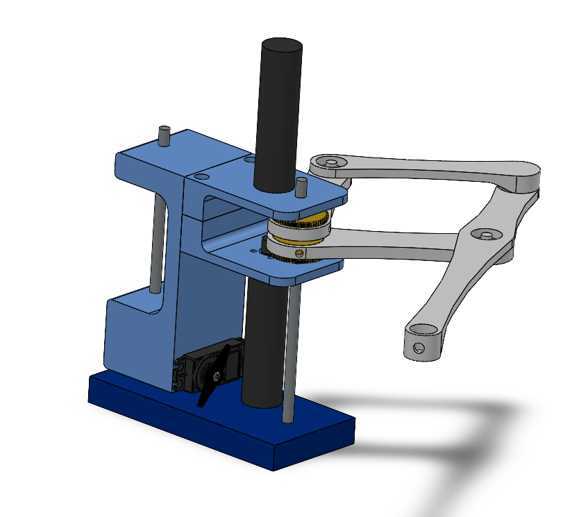

# Term Project

# System Description

The goal of our project is to be able to create a system that makes drawings similar to a plotter. Our proposed system will accomplish the goal of creating a drawing and also allows for curved motion directly through the motion of the arm. Our system consists of a robot arm-type system inspired by the Line-us drawing robot. We will use the two Pittman DC geared motors found in the ME405 tubs to control a set of four linkages. The two motors will me mounted inline vertically, facing each other, and connect at the center location to two of the linkages. A Tower Pro MG995 servo motor borrowed from the robotics lab will be used to control an up and down movement to raise and lower the pen from the drawing surface. We will have a 2.5 degree of freedom system with two degrees of freedom from the two DC geared motors and a half degree of freedom from the servo motor to raise and lower the system. The four linkages form a semi-diamond shape that creates a robot arm that functions similarly to a SCARA-type robot arm. We plan on laser-cutting the linkages from scrap pieces of acrylic that are approximately 0.25" thick. The motors will be mounted using a 3D-printed casing. Additional components required for the up and down movement of the system will also be 3D-printed. 

Reference for concept: https://www.line-us.com/

# Hardware Design

Figure 1. CAD of concept drawing robot

## Bill of Materials

| Qty. | Part                    | Source                | Est. Cost |
|:----:|:----------------------  |:----------------------|:---------:|
|  2   | ME405 Pittman DC Motors | ME405 Tub             |     -     |
|  1   | Nucleo Board with Shoe  | ME405 Tub             |     -     |
|  1   | Tower Pro MG995 Servo   | Robotics Lab          |     -     |
|  1   | Pen                     | Someone on Team       |     -     |
|  1   | PLA 3D Filament         | Someone on Team       |     -     |
|  1   | Acrylic                 | A Dumpster Somewhere  |     -     |

An introduction to your project. What is the purpose of the device you have created? For whose use is it intended?
An overview of the hardware design.  We need to know about the hardware on which the software in your repository will operate.
An overview of the software design. This should be brief and general, with a link to your Doxygen pages -- the pages describe the details of the software, so there's no need to repeat that here.
A discussion of the results.  How did you test your system?  How well has your system performed in these tests?
A brief discussion of what you've learned about the project and recommendations for anyone who would like to build upon your work. This does not mean a discussion of what you learned about mechatronics in general; that belongs in other places.  It is a discussion of what worked well and what didn't for this device.
Links to additional files as appropriate.  For example, if you have a directory containing CAD drawings, you might provide a link here.
