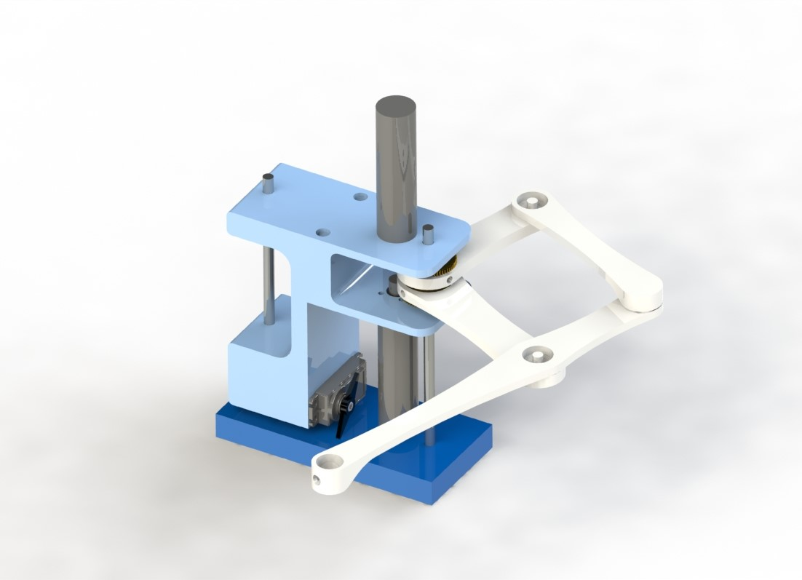

# Term Project - Drawing bot

# System Description

The goal of our project is to be able to create a system that makes drawings similar to a plotter. Our system will accomplish the goal of creating a drawing with straigh or curved lines through 2.5 degrees of freedom in the design. Any user using an HPGL file to replicate their digital drawing will be able to use this device.

# Hardware Design

Our system consists of a robot arm-type system inspired by the Line-us drawing robot. We will use the two Pittman DC geared motors found in the ME405 tubs to control a set of four linkages. The two motors will me mounted inline vertically, facing each other, and connect at the center location to two of the linkages. A Tower Pro MG995 servo motor borrowed from the robotics lab will be used to control an up and down movement to raise and lower the pen from the drawing surface. We will have a 2.5 degree of freedom system with two degrees of freedom from the two DC geared motors and a half degree of freedom from the servo motor to raise and lower the system. The four linkages form a semi-diamond shape that creates a robot arm that functions similarly to a SCARA-type robot arm. We plan on 3D printing the linkages from PLA plastic. The motors will be mounted using a 3D-printed casing. Additional components required for the up and down movement of the system will also be 3D-printed. Gears, bearings will be added to increase movement resolution and smoothness to the movement. The current design of the Drawing bot is seen in Figure 1. below.

Figure 1. CAD of concept Drawing Bot

## Bill of Materials for Drawing Bot

| Qty. | Part                    | Source                | Est. Cost |
|:----:|:----------------------  |:----------------------|:---------:|
|  2   | ME405 Pittman DC Motors | ME405 Tub             |     -     |
|  1   | Nucleo Board with Shoe  | ME405 Tub             |     -     |
|  1   | Tower Pro MG995 Servo   | Robotics Club         |     -     |
|  1   | Pen                     | Someone on Team       |     -     |
|  1   | PLA 3D Filament         | Someone on Team       |     -     |
|  8   | M3-8mm Screws           | REV Robotics          |     -     |
|  2   | KHK-BSS0.5-60B Gears    | Robotics Club         |     -     |
|  3   | ID 6mm OD 17mm Bearing  | Robotics Club         |     -     |
|  2   | Stainless Bars Tools    | Robotics Club         |     -     |
|  2   | M4 Screws               | Robotics Club         |     -     |
|  2   | M4 Screws               | Robotics Club         |     -     |

# Software Design
An overview of the software design. This should be brief and general, with a link to your Doxygen pages -- the pages describe the details of the software, so there's no need to repeat that here.

Our program is written in micropython and consists of three tasks written in main.py: two motor tasks and one plotter task. The plotter tasks runs a finite state machine, as represented by the state transition diagram in Figure 2, consists of the following states: read HPGL, initialize, lifting pen up, setting pen down, and moving. When the program is run, the plotter task reads a section of the HPGL file up to the first semicolon. The first two strings of each section will determine which state the FSM will transition to next: "IN" for initialize, "PU" for lifting the pen up, "PD" for setting the pen down, etc. At their respective state, the program will carry out a function such as setting the appropriate duty cycle for the servo motor to lift the pen up. The FSM then checks to see if there is any coordinate data following the first two strings, the program will perform the inverse kinematics, using inversekinematic.py, and move the robot accordingly. When the robot completes all movements in the section, the FSM jumps back to the state where it reads the HPGL file for the next set of instructions. The two motor tasks are rather simple: it runs a proportional controller, using controller.py, to set the motor in the desired position specified within the plotter task. Finally, when the program raches the end of the HPGL file, it simply enters a finish state. 

Documentation of Code: https://chrisuzuki62.github.io/me405_termproject/

# Results
A brief discussion of what you've learned about the project and recommendations for anyone who would like to build upon your work. This does not mean a discussion of what you learned about mechatronics in general; that belongs in other places.  It is a discussion of what worked well and what didn't for this device.

The final demonstration video can be seen here: https://youtu.be/_0DGsNZlUL0

From the video and other tests we found that our system overall was able to perform its task to replicate the digital drawings. We had the Drawing bot draw two images, one being a star and the other being a graffiti style S. The two tests showed that the design struggles to draw long straight lines as one arm linkage would have to travel faster than the other. This situation would occur as it is plotting between two points and take whatever path to reach those points. A solution to this problem is adding an intermediary point could be to the HPGL file or increasing the resolution/points to the file, but byte capacity restrained this solution. Lastly as seen in the video our device was experiencing some overshoot when arriving at the correct coordinate. More tuning of the P gain controller would resolve that issue.
Overall, from the project our group has learned tp spend more time thinking of alternative designs because not all certain features will work the way it is designed. We had three alternative designs for the 0.5 degree freedom to the lift the pen, but all of them did not work due to inconsistency or products not offering the rated strength. We quickly had resolved this issue with our pen pivoting with a mini servo attached to the arm resulting in pen swipe marks instead of a clean finish with the pen lifting. If improvments were to made to this project it would to improve the pen lifting mechanism, more tuning of the controller gains, and increasing data storage efficiency or capacity to draw higher resolution images.

# Resources
Reference for concept: https://www.line-us.com/

GrabCAD repository: https://workbench.grabcad.com/workbench/projects/gcqKvgfJRzyWo_CtzvtAKlI-tx9kWjHW_sFcfrkAEgMBij#/space/gcChDJD7kWcv_jVIQOxMI8suMSjF-Yvh4EW6TlkZzvZ4QA

CAD Drawings: 
